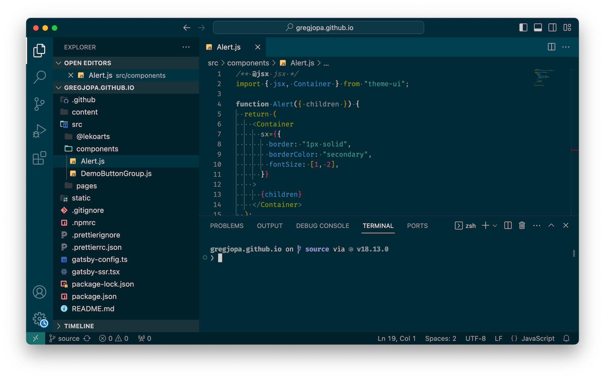

# dotfiles

> This is my dotfile repository. There are many like it, but this one is mine.

These are my dotfiles for macOS. They are managed using a bare repository (`git init --bare`).

## Installation
```sh
git clone --separate-git-dir=$HOME/.dotfiles https://github.com/gregjopa/dotfiles.git dotfiles-tmp
rsync --recursive --verbose --exclude '.git' dotfiles-tmp/ $HOME/
rm -rf dotfiles-tmp

alias config='git --git-dir=$HOME/.dotfiles/ --work-tree=$HOME'
config config status.showUntrackedFiles no
```

## Usage
```sh
config status
config add .gitconfig
config commit -m 'Add gitconfig'
config push
```

## Screenshot



| Category | Details |
| --- | --- |
| Editor | [Visual Studio Code](https://code.visualstudio.com/) |
| Terminal | [oh-my-zsh](https://ohmyz.sh/) |
| Terminal Theme | [Starship](https://starship.rs/) |
| Font Family | [Fira Code](https://github.com/tonsky/FiraCode) |
| Color Theme | [Material Theme](https://marketplace.visualstudio.com/items?itemName=Equinusocio.vsc-material-theme) - Darker High Contrast |
| File Icon Theme | [Material Theme Icons](https://marketplace.visualstudio.com/items?itemName=PKief.material-icon-theme) - Darker |

Note that the config for Visual Studio Code is not managed by this dotfiles repo.


## Notes from Inital Setup

```sh
git init --bare $HOME/.dotfiles
alias config='git --git-dir=$HOME/.dotfiles/ --work-tree=$HOME'
config config status.showUntrackedFiles no
config remote add origin git@github.com:gregjopa/dotfiles.git
```

## Aknowledgements

- https://www.atlassian.com/git/tutorials/dotfiles
- https://github.com/Siilwyn/my-dotfiles
- https://github.com/mathiasbynens/dotfiles
- https://github.com/cowboy/dotfiles
- https://github.com/alrra/dotfiles
- https://github.com/JDevlieghere/dotfiles
- https://gist.github.com/rab/4067067
